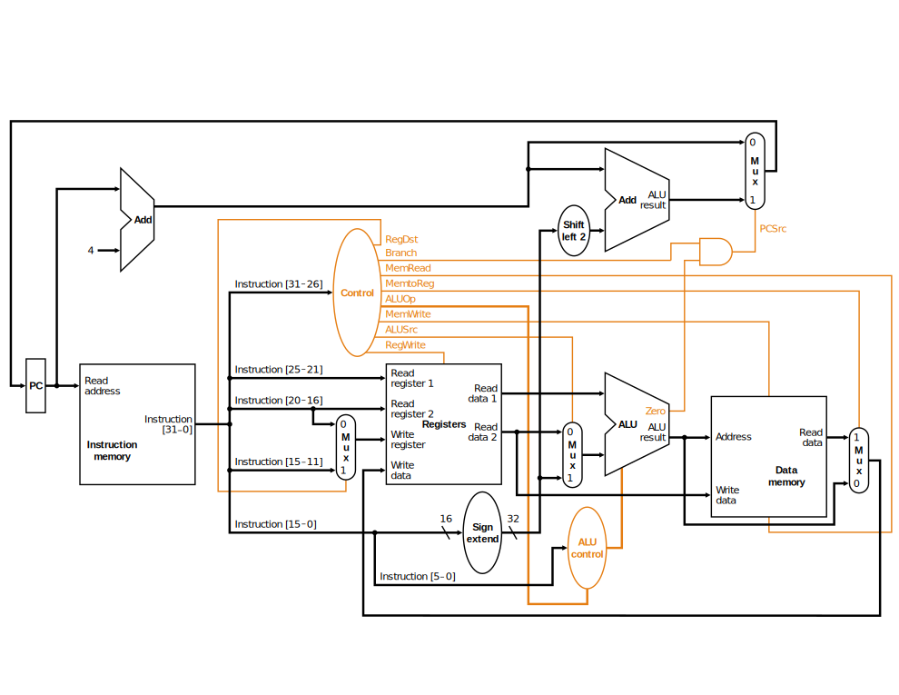

#  Mini Virtual MIPS Architecture in Type-Safe way

Subset of Virtual MIPS Architecture written in Haskell in Type-Safe way


## MIPS Schematic

Here is the whole schematic implemented virtually in Haskell.



You can also get detail specification of Main Control and ALU Control from URL below.

http://web-ext.u-aizu.ac.jp/~yliu/teaching/comparch/lab4.html

## How to run

```
$ stack build
$ stack exec mini-mips-exe
```

## Technologies & Main GHC Pragmas

* Yampa (FRP library)
* Arrows
* GADTs (Generalized Algebraic Data Types)
* TypeFamilies
* TypeOperators

Some of these technologies make it to be type-safe!

## Type safety

`iRFormat`, for example, is a typed-legth list, which provide type safety more than normal list.

```hs
let iRFormat = O:*O:*O:*O:*O:*O:*End :: Bits N6
```
(Type `:: Bits N6` or  `:: Bits N32` is typed-length list.)

`Bits` has some list-operators which has type safety.

```hs
headBits :: Bits (Succ n) -> Bit
takeBits :: SNat n -> Bits m -> Bits (Min n m)
dropBits :: SNat n -> Bits m -> Bits (m - n)
(+*+) :: Bits n -> Bits m -> Bits (n+m) -- similar to (++) in list
```


### Normal List

```hs
let list = [] :: [Bool]
head list -- Compile pass. but "Exception: Prelude.head: empty list"
```

### `Bits` (type-safe)

```hs
let bits = End :: Bits N0 -- similar to []
headBits bits -- Compile Error (GOOD!)
```
